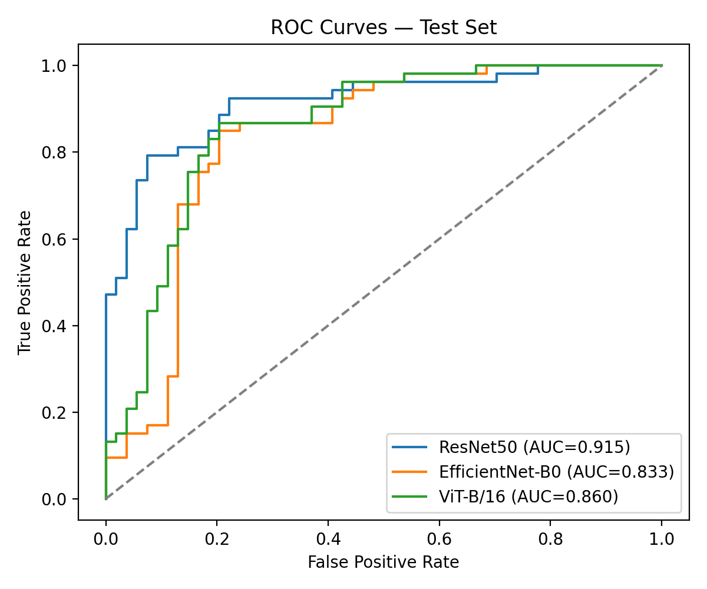
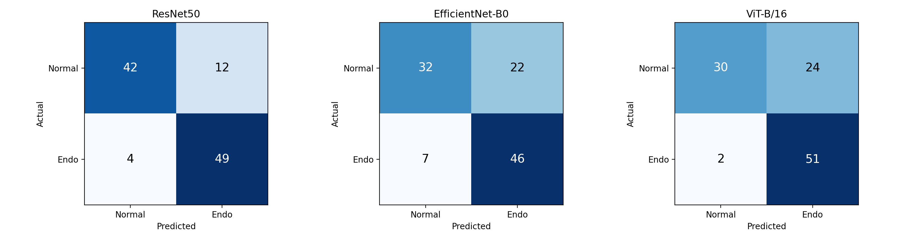
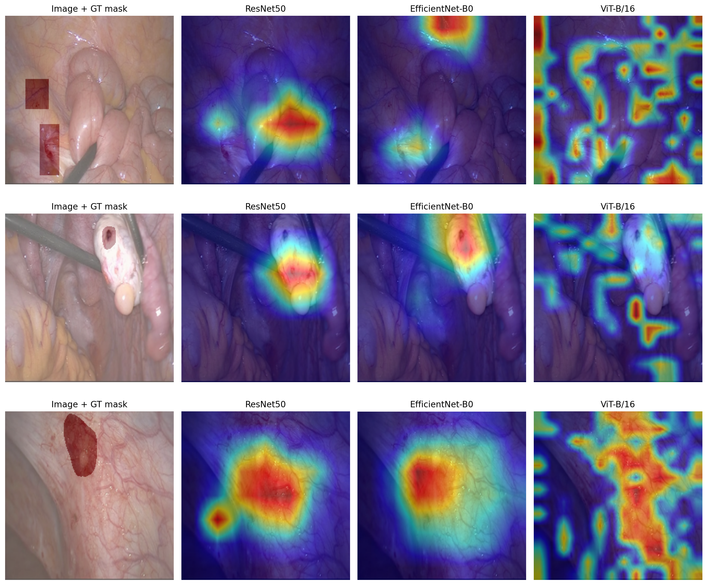

# Explainable Endometriosis Classification in Laparoscopic Images

**Comparing CNN and Vision Transformer models, and checking whether their Grad-CAM explanations point at the real lesions.**

This project compares three ImageNet-pretrained models on binary endometriosis detection (endometriosis vs. normal) using still frames from the **GLENDA v1.5** laparoscopy dataset:

- **ResNet50** (CNN)
- **EfficientNet-B0** (CNN)
- **ViT-B/16** (Vision Transformer)

It also goes beyond accuracy. The Grad-CAM heatmaps are compared with the **373 expert-annotated lesion masks**, which shows whether each model looks at the actual lesion when it makes a decision.

> Status: experiments done, paper being written. See [Roadmap](#roadmap).

---

## Key findings

| Model | Accuracy | Precision | Recall | F1 | ROC-AUC |
|---|---|---|---|---|---|
| **ResNet50** | **0.851** | **0.803** | 0.925 | **0.860** | **0.915** |
| EfficientNet-B0 | 0.729 | 0.677 | 0.868 | 0.760 | 0.833 |
| ViT-B/16 | 0.757 | 0.680 | **0.962** | 0.797 | 0.860 |

*Held-out test set: 107 images from cases that never appear in training (53 endometriosis, 54 normal).*

**Grad-CAM localization vs. ground-truth lesion masks** (53 test pathology images):

| Model | Mean IoU (± std) | Pointing Game | Coverage |
|---|---|---|---|
| ResNet50 | 0.148 ± 0.145 | 0.264 | 0.165 |
| **EfficientNet-B0** | **0.238 ± 0.163** | **0.453** | **0.212** |
| ViT-B/16 | 0.032 ± 0.052 | 0.019 | 0.069 |

**Takeaways**
1. **ResNet50 is the best classifier.** It has the highest AUC and F1, with a good balance of precision and recall.
2. **High accuracy does not mean good explanations.** EfficientNet-B0 has the *lowest* AUC but finds lesions best, with about 1.6× ResNet50's IoU.
3. **ViT-B/16 classifies reasonably well, but its Grad-CAM heatmaps don't find the lesions.** They are spread out and barely overlap the lesion masks, which is a known limit of gradient-based CAM on transformers. Attention-rollout style explanations are planned as future work.
4. All three models have high recall, which suits a screening or second-opinion use case.

<p align="center">
  
  
</p>

<p align="center">
  
</p>

---

## Method

1. **Balanced subset.** GLENDA is very imbalanced: 373 pathology frames vs. 13,438 normal frames (about 1:36). All 373 pathology frames are kept. 373 normal frames are sampled **round-robin across 27 videos**, which avoids near-duplicate consecutive frames.
2. **Leakage-free split by patient/case (70/15/15).** Whole cases or videos are assigned to train, val or test, so frames from the same surgery never appear in two splits. Result: train 528 / val 111 / test 107. This was verified with 0 leaking groups out of 129.
3. **Transfer learning.** ImageNet weights, full fine-tuning, Adam optimizer. Learning rate is 1e-4 for the CNNs and 2e-5 for ViT. Early stopping on validation AUC (patience 6, max 30 epochs). Augmentation: flip, ±15° rotation, color jitter. `seed=42`.
4. **Evaluation.** Accuracy, Precision, Recall, F1, ROC-AUC, confusion matrices and ROC curves, all on the untouched test set.
5. **Explainability.** Grad-CAM heatmaps are compared against the GLENDA lesion masks using IoU, the Pointing Game and Coverage.

Full write-ups: [docs/methodology.md](docs/methodology.md) · [docs/literature_review.md](docs/literature_review.md) (24 papers) · pipeline diagram: [diagrams/Methodology.drawio](diagrams/Methodology.drawio)

---

## Repository structure

```
├── scripts/
│   └── prep_dataset.py        # builds the balanced, case-wise split dataset (+ lesion masks, manifest)
├── notebooks/
│   └── Endometriosis.ipynb    # Colab: training (ResNet50, EfficientNet-B0, ViT-B/16) + test evaluation
├── data/
│   └── manifest.csv           # exact file → class → case/video → split assignment (reproducibility)
├── results/                   # metrics CSVs + figures used in the paper
├── docs/                      # methodology and literature review
├── diagrams/                  # methodology pipeline (draw.io)
└── requirements.txt
```

## Reproducing

1. **Get the data.** Download GLENDA v1.5 from the [official source](https://ftp.itec.aau.at/datasets/GLENDA/) and put it in `Dataset/`:
   ```
   Dataset/Glenda_v1.5_classes/Glenda_v1.5_classes/{frames,annots}/
   Dataset/GLENDA_v1.5_no_pathology/no_pathology/frames/<video>/
   ```
2. **Build the balanced split** (standard library only):
   ```bash
   python scripts/prep_dataset.py      # -> data/{train,val,test}/..., data/masks/, data/manifest.csv
   ```
   Zip `data/` as `glenda_balanced.zip`.
3. **Train and evaluate.** Open `notebooks/Endometriosis.ipynb` in Google Colab with a T4 GPU, upload the zip, and run all cells.

> Results can differ slightly between runs (about ±0.02 AUC) because cuDNN is not fully deterministic.

## Roadmap

- [x] Balanced, leakage-free dataset construction
- [x] CNN vs. ViT training and test-set evaluation
- [x] Grad-CAM vs. ground-truth mask localization metrics
- [ ] Upload the Grad-CAM / IoU evaluation notebook
- [ ] 5-fold grouped cross-validation
- [ ] Statistical significance: McNemar's test and 95% CI for AUC
- [ ] Attention-rollout explanations for ViT
- [ ] Paper submission

## Dataset and ethics

This work uses the public **GLENDA** dataset (Leibetseder et al., *GLENDA: Gynecologic Laparoscopy Endometriosis Dataset*, MMM 2020, [doi:10.1007/978-3-030-37734-2_36](https://doi.org/10.1007/978-3-030-37734-2_36)), released under **CC BY-NC 4.0**. No images are redistributed in this repository, except the Grad-CAM overlay figure made for the paper, which is shared non-commercially with attribution. The data is de-identified and public, so no extra IRB approval was needed.

*For research purposes only. Not a medical device.*

## Author

**Mozahid**, [@Mozahid-DIU](https://github.com/Mozahid-DIU)
